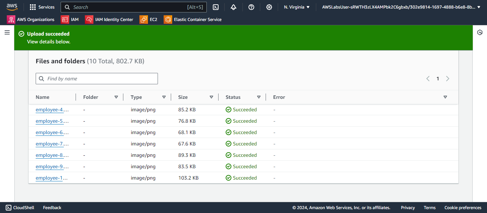

# AWS IAM Exploration

## Description
This lab involved exploring AWS Identity and Access Management (IAM) by managing users, groups, and policies. The goal was to understand how IAM controls access to AWS resources and experiment with different configurations.

## Key Steps
1. **Explore IAM Users and Groups:**
   - Reviewed existing users and their permissions.
   - Explored group policies and the permissions they grant.
   

2. **Test Access Levels:**
   - Logged in with different IAM users to test their access levels.
   - Verified permissions for actions in EC2 and S3.

3. **Manage IAM Resources:**
   - Added users to groups to inherit permissions.
   - Experimented with policies and service access.

